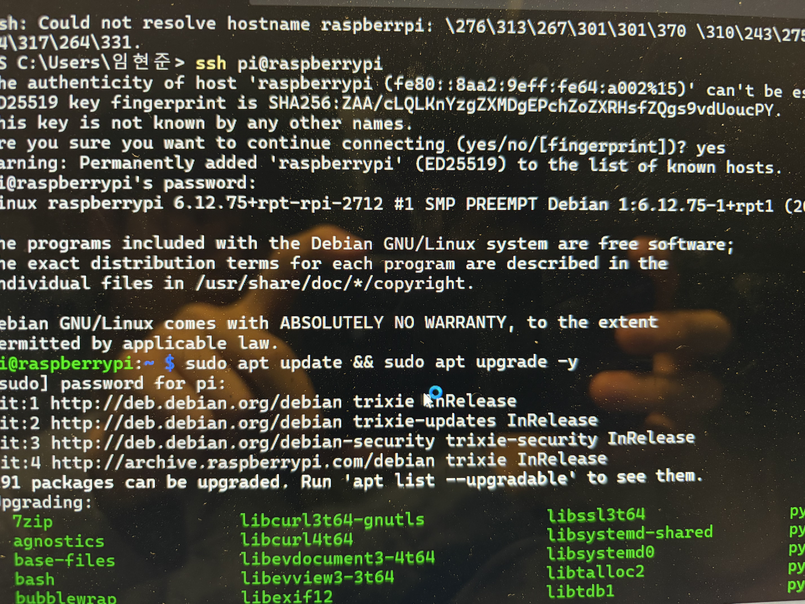
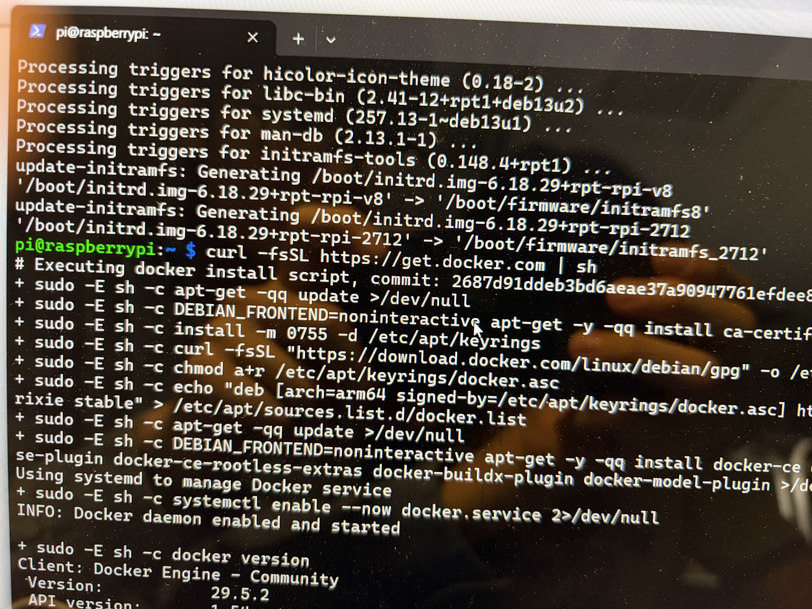
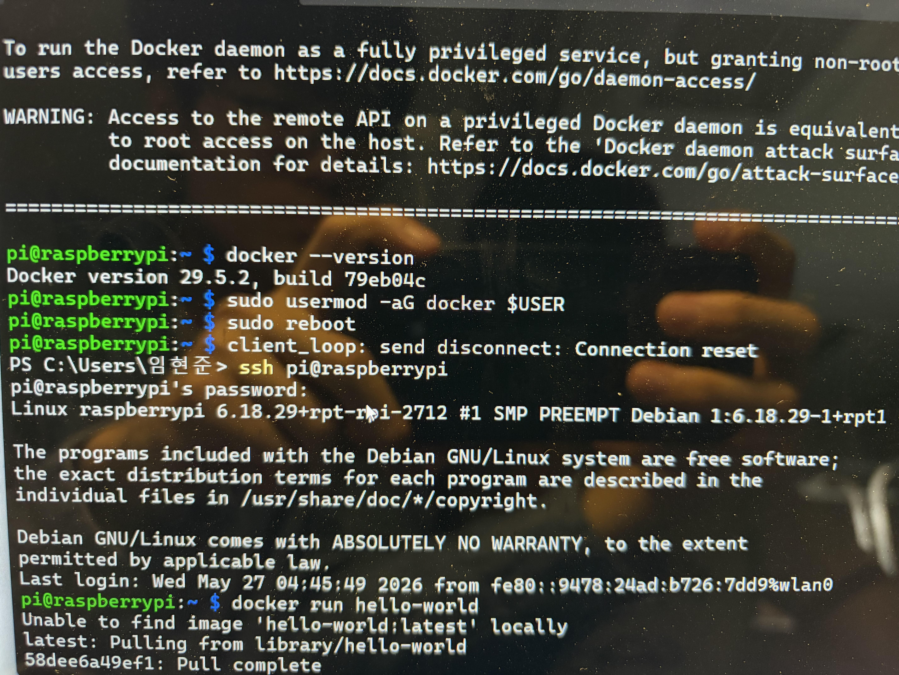
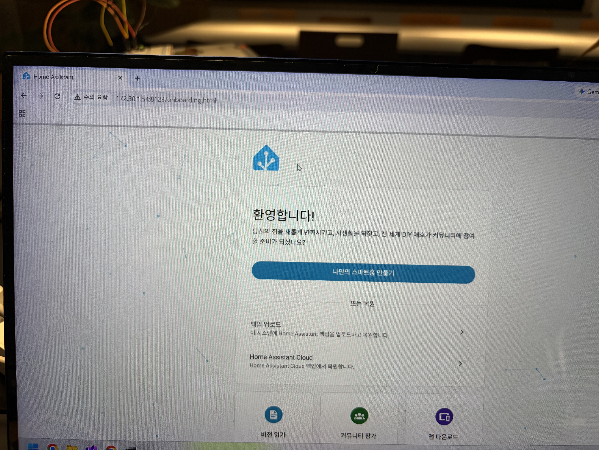
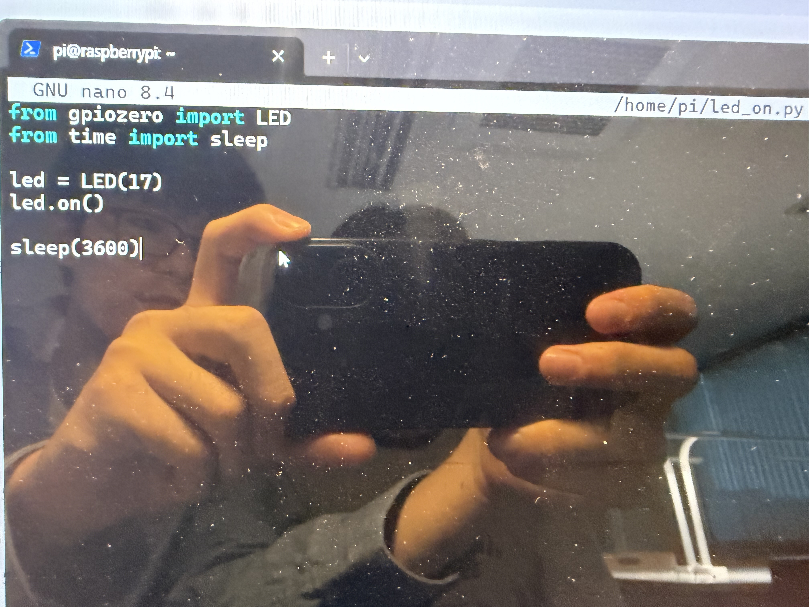
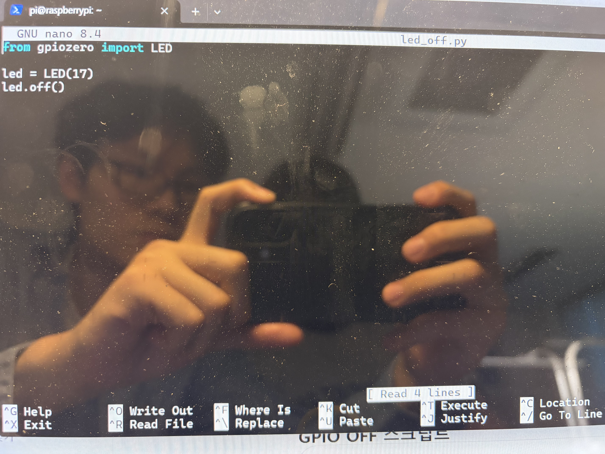
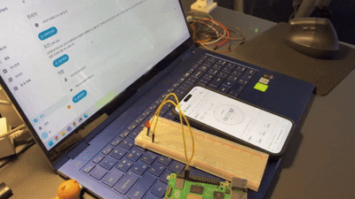

# Getting Started with Home Assistant on Raspberry Pi

> 작업 일시: 2026년 5월 26일 20:00 ~ 5월 27일 07:00


---

## 1. OS 업데이트

```bash
sudo apt update && sudo apt upgrade -y
```



---

## 2. Docker 설치

```bash
curl -fsSL https://get.docker.com | sh
```

설치 후 버전 확인:

```bash
docker --version
```



---

## 3. 현재 사용자를 docker 그룹에 추가

```bash
sudo usermod -aG docker $USER
sudo reboot
```

재부팅 후 정상 작동 확인:

```bash
docker run hello-world
```



---

## 4. Home Assistant 폴더 생성 후 컨테이너 실행

```bash
mkdir ~/homeassistant
```

```bash
docker run -d \
  --name homeassistant \
  --restart=unless-stopped \
  --privileged \
  -e TZ=Asia/Seoul \
  -v ~/homeassistant:/config \
  --network=host \
  ghcr.io/home-assistant/home-assistant:stable
```

컨테이너 실행 확인:

```bash
docker ps
```


---

## 5. 브라우저 접속

- `hostname -I` 명령어로 IP 주소 확인: `172.30.1.54`
- 브라우저에서 접속: `http://172.30.1.54:8123`



---

## 6. LED 자동화를 위한 HW04 회로 조립하기

HW04에서 사용한 회로를 그대로 조립하였습니다.

---

## 7. Flask 설치하기

처음에는 파이썬 파일을 만들어 GPIO를 제어하려 했으나 에러가 발생하였습니다.
Docker 안에서는 GPIO 핀 접근 권한이 제한된다는 것을 알게 되어 Flask 방식으로 전환하였습니다.






```bash
pip install flask --break-system-packages
```

---

## 8. 서버 파일 만들고 실행

```bash
nano gpio_server.py
```

```python
from flask import Flask
import lgpio

app = Flask(__name__)

GPIO = 17

@app.route('/on')
def on():
    h = lgpio.gpiochip_open(0)
    lgpio.gpio_claim_output(h, GPIO)
    lgpio.gpio_write(h, GPIO, 1)
    lgpio.gpiochip_close(h)
    return "LED ON"

@app.route('/off')
def off():
    h = lgpio.gpiochip_open(0)
    lgpio.gpio_claim_output(h, GPIO)
    lgpio.gpio_write(h, GPIO, 0)
    lgpio.gpiochip_close(h)
    return "LED OFF"

app.run(host='0.0.0.0', port=5000)
```

```bash
python3 gpio_server.py
```


---

## 9. Home Assistant 설정

터미널을 닫으면 Flask 서버도 종료되므로, 새 터미널 창을 열어 설정합니다.

```bash
sudo nano ~/homeassistant/configuration.yaml
```

```yaml
rest_command:
  led_on:
    url: "http://172.30.1.54:5000/on"

  led_off:
    url: "http://172.30.1.54:5000/off"
```


설정 적용을 위해 컨테이너 재시작:

```bash
docker restart homeassistant
```

---

## 10. 자동화 시스템 만들기

Home Assistant 웹 UI에서 자동화를 추가하여 트리거와 작업을 설정하였습니다.
원하는 시간에 LED 켜기/끄기 자동화를 각각 만들었습니다.


---

## 11. 실행 결과

설정한 시간에 맞춰 LED가 자동으로 켜지고 꺼지는 동작을 확인하였습니다.


